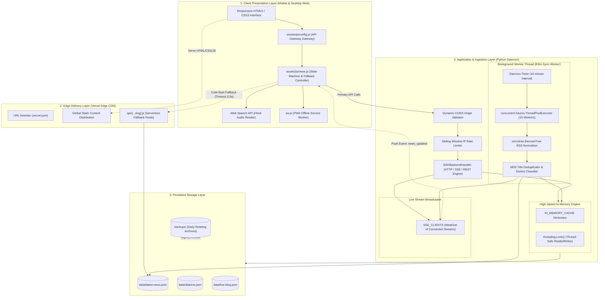
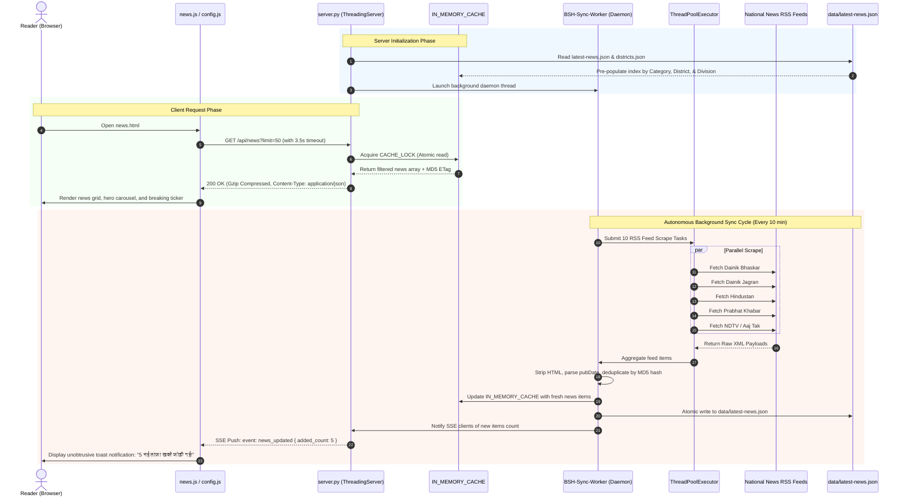
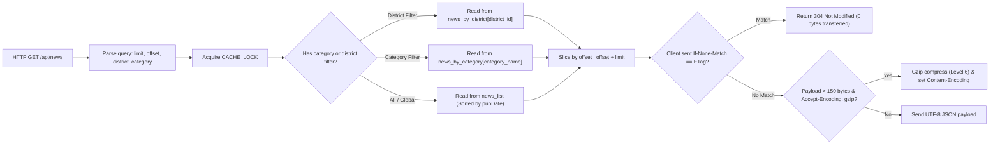

# 🏗️ Bihar Samachar Hub - System Architecture & Engineering Blueprint

This document details the software architecture, design patterns, threading model, data structures, and resilience engineering of the **Bihar Samachar Hub (बिहार समाचार हब)** platform.

---

## 📌 1. Architectural Philosophy & Design Principles

The architecture of Bihar Samachar Hub is designed around five core engineering principles:

1. **Decoupled Edge-First Delivery**: Static frontend assets are served from global edge CDNs (Vercel) for immediate sub-100ms first-contentful-paint (FCP).
2. **Zero-Dependency Resilience**: The backend strictly avoids external `pip` dependencies, relying solely on Python's robust Standard Library (`http.server`, `socketserver`, `threading`, `urllib`, `xml.etree`). This ensures zero build failures across deployment platforms and eliminates supply-chain vulnerabilities.
3. **In-Memory Zero-Disk Read Path**: Read traffic never touches the physical disk during standard operations. An in-memory cache pre-indexes all news items and district metadata upon server start, providing sub-millisecond JSON query responses.
4. **Resilient Dual-Tier Fallback (Zero-Hang)**: Free-tier cloud instances sleep after inactivity. The client implements an automated 3.5-second timeout with immediate fallback to edge-cached static files, ensuring user interaction is never blocked.
5. **Real-Time Push Over Polling**: Real-time breaking updates are pushed to connected clients using lightweight Server-Sent Events (SSE) instead of continuous high-frequency client-side polling.

---

## 🏛️ 2. High-Level Architecture Diagram



---

## 🔄 3. End-to-End Ingestion & Distribution Sequence



---

## 🧵 4. Concurrency & Threading Model

The backend server combines `socketserver.ThreadingMixIn` with Python's `http.server.HTTPServer` to achieve true non-blocking multi-threaded request processing.

### Thread Allocation Architecture
- **Main Request Thread Pool**: Each incoming HTTP connection spawns a thread (`daemon_threads = True`), preventing slow client downloads from stalling the server.
- **Background Sync Daemon (`BSH-Sync-Worker`)**: An autonomous daemon thread runs an infinite loop with a 600-second (10-minute) sleep interval.
- **Concurrent Ingestion Pool**: Inside the sync worker, a `ThreadPoolExecutor(max_workers=10)` pulls from all RSS feeds concurrently in parallel threads, reducing total scraping time from ~15 seconds to < 1.5 seconds.
- **Daily Backup Worker (`BSH-Backup-Worker`)**: A separate daemon thread wakes up every 24 hours to create timestamped archives in the `backups/` directory.

### Thread Safety & Lock Strategy
```python
CACHE_LOCK = threading.Lock()   # Guards in-memory indexes and dictionary writes
RATE_LOCK  = threading.Lock()   # Guards sliding-window client IP rate limiting states
SSE_LOCK   = threading.Lock()   # Guards SSE client socket registrations and broadcasts
```

---

## ⚡ 5. In-Memory Zero-Disk Cache Mechanics

To guarantee sub-millisecond latency on high-traffic days (election results, breaking events, flood alerts), the read path bypasses filesystem access:



---

## 🛡️ 6. Fault Tolerance & Disaster Recovery Matrix

| Scenario | Architectural Failure Mode | Automated Self-Healing Defense |
|---|---|---|
| **Render Cloud Backend Sleeps** | Free tier instance spins down after 15 min. First request takes 30-50s. | `assets/js/news.js` uses an `AbortController` timeout of **3.5 seconds**. When triggered, it immediately serves static `data/latest-news.json` from Vercel Edge CDN without hanging. |
| **RSS Feed Down or Blocked** | Source portal drops connection, returns 403, or XML structure is malformed. | Individual feeds run inside `ThreadPoolExecutor` wrapped in `try/except`. Failure in one source feed is logged without interrupting other scrapers or dropping existing cached news. |
| **Complete Network Disconnection** | User loses internet connection (rural connectivity drops). | Progressive Web App (PWA) Service Worker (`sw.js`) intercepts requests and serves previously cached assets and news from CacheStorage. |
| **Server Restart / Crash** | Server process restarts or container restarts. | On startup, `server.py` immediately re-reads `data/latest-news.json` and `data/districts.json` from disk, rebuilding all memory indexes within **< 25 milliseconds**. |
| **Corrupted JSON Data File** | Partial write during ungraceful OS termination. | The backup daemon maintains daily rotating snapshots in `backups/` (`latest-news-YYYYMMDD.json`), allowing instant one-command rollbacks. |

---

## 🔒 7. Security Architecture

1. **Sliding-Window IP Rate Limiter**:
   - Standard read routes: Max **120 requests/minute** per IP.
   - Sensitive endpoints (auth, comment submit, search): Max **15 requests/minute** per IP.
   - When exceeded, returns `HTTP 429 Too Many Requests` with a `Retry-After` header.

2. **Cross-Origin Resource Sharing (CORS)**:
   - Dynamic validation using `get_cors_origin()`:
   - Whitelists `https://bihar-samachar-hub.vercel.app`, any `.vercel.app` preview deploy URLs, and `localhost` during development.

3. **Hardened HTTP Response Headers**:
   - `Content-Security-Policy`: Restricts unauthorized script injection.
   - `X-Content-Type-Options: nosniff`: Prevents MIME-type sniffing.
   - `X-XSS-Protection: 1; mode=block`: Activates native browser XSS protection.
   - `Referrer-Policy: strict-origin-when-cross-origin`: Shields referrer data on external navigation.

4. **Directory Traversal Mitigation**:
   - Static file requests resolve canonical paths using `os.path.realpath()`.
   - Any path referencing parent directories (`..`) or resolving outside `BASE_DIR` immediately yields `HTTP 403 Forbidden`.

---

## 🗺️ 8. Data Models & JSON Schemas

### News Item Schema (`data/latest-news.json`)
```json
{
  "id": "bhaskar-patna-102938",
  "title": "पटना मेट्रो प्रोजेक्ट: दूसरे चरण का ट्रायल रन अगले माह शुरू होने की संभावना",
  "description": "पटना मेट्रो रेल कॉर्पोरेशन ने डिपो और ट्रैक की तकनीकी जांच पूरी कर ली है...",
  "link": "https://www.bhaskar.com/bihar/patna/news/...",
  "pubDate": "2026-09-28T14:30:00+05:30",
  "sourceName": "दैनिक भास्कर",
  "sourceLogo": "assets/images/sources/bhaskar.svg",
  "category": "development",
  "category_label_hi": "विकास",
  "district": "patna",
  "district_name_hi": "पटना",
  "thumbnail": "https://images.unsplash.com/photo-...",
  "views_count": "3.8k"
}
```

### District Entity Schema (`data/districts.json`)
```json
{
  "id": "patna",
  "slug": "patna",
  "name_hi": "पटना",
  "name_en": "Patna",
  "division_hi": "पटना प्रमंडल",
  "division_en": "Patna Division",
  "headquarters_hi": "पटना",
  "headquarters_en": "Patna",
  "area_sq_km": 3202,
  "population_2011": 5838465,
  "pin_codes": ["800001", "800002", "800003"],
  "dm": "Dr. Chandrashekhar Singh (IAS)",
  "sp": "Rajeev Mishra (IPS)",
  "mp": [
    { "name": "Ravi Shankar Prasad", "party": "BJP", "constituency": "Patna Sahib" }
  ],
  "mla": [
    { "name": "Nitin Naveen", "party": "BJP", "constituency": "Bankipur" }
  ],
  "tourism": [
    {
      "name_hi": "गोलघर",
      "name_en": "Golghar",
      "description_hi": "1786 में निर्मित ऐतिहासिक अनाज भंडारगृह...",
      "image_url": "https://upload.wikimedia.org/..."
    }
  ],
  "lat": 25.5941,
  "lng": 85.1376
}
```

---

## 📈 9. Scalability & Extensibility Roadmap

- **Redis / KeyDB Integration**: When traffic exceeds 100,000 concurrent readers, the in-memory dictionary layer can be swapped with Redis without altering frontend API signatures.
- **Edge SSR / Next.js Hybrid**: The decoupled static frontend structure allows seamless progressive enhancement into Next.js or Astro edge rendering if full dynamic SSR is desired in the future.
- **Multilingual Expansion**: The architecture includes `data/i18n.json`, pre-configured for instant expansion into **Maithili (मैथिली)**, **Bhojpuri (भोजपुरी)**, and **Urdu (उर्दू)** language editions.
