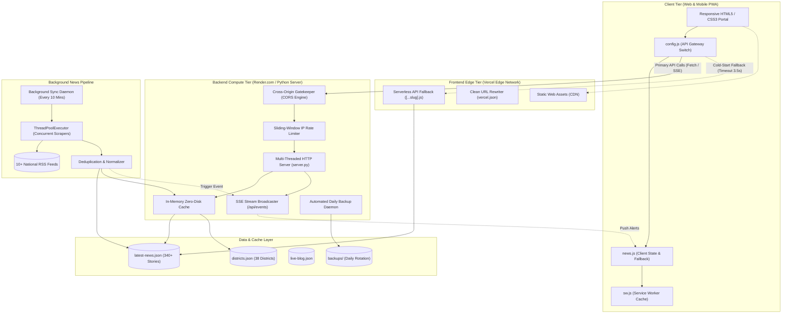
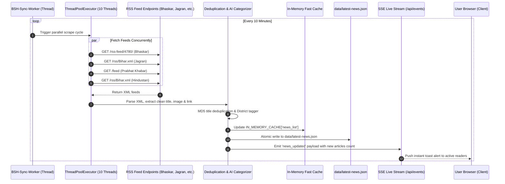
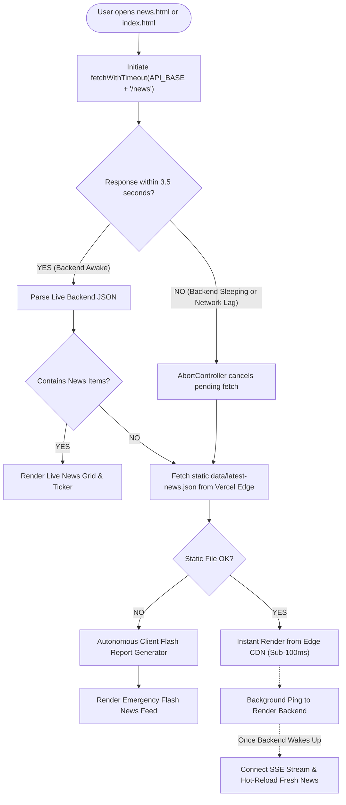
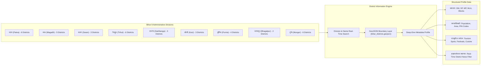

# 🏛️ Bihar Samachar Hub (बिहार समाचार हब)

<p align="center">
  
</p>

<p align="center">
  <strong>बिहार का प्रमुख रियल-टाइम हाइपरलोकल समाचार और 38 जिलों का संपूर्ण डिजिटल पोर्टल</strong><br>
  <em>Hyperlocal Real-Time Hindi News Aggregator & 38 Bihar Districts Digital Information Platform</em>
</p>

<p align="center">
  <a href="https://bihar-samachar-hub.vercel.app"></a>
  <a href="https://github.com/aziz04076/bihar_samachar_hub"></a>
  <a href="#-system-architecture"></a>
  <a href="#-zero-hang-cold-start-defense"></a>
  <a href="#-pwa--offline-ready"></a>
</p>

---

## 📑 Table of Contents (विषय सूची)
- [✨ Key Features](#-key-features)
- [🏗️ System Architecture (प्रणाली आर्किटेक्चर)](#️-system-architecture)
  - [High-Level Hybrid Topology](#1-high-level-hybrid-topology)
  - [End-to-End Data Pipeline & Ingestion](#2-end-to-end-data-pipeline--ingestion)
  - [Zero-Hang & Cold-Start Defense](#3-zero-hang--cold-start-defense)
  - [Interactive District & Geo-Information System](#4-interactive-district--geo-information-system)
- [🧩 Component Breakdown](#-component-breakdown)
- [📁 Project Directory Structure](#-project-directory-structure)
- [🔌 REST & Streaming API Reference](#-rest--streaming-api-reference)
- [⚡ Quick Start & Local Run](#-quick-start--local-run)
- [🚀 Production Deployment Guide](#-production-deployment-guide)
  - [Deploying Frontend on Vercel](#a-deploying-frontend-on-vercel)
  - [Deploying Backend on Render.com](#b-deploying-backend-on-rendercom)
- [🛡️ Security & Performance Optimization](#️-security--performance-optimization)
- [📖 Detailed Engineering Specs](#-detailed-engineering-specs)

---

## ✨ Key Features

- **⚡ Real-Time Multi-Source RSS Aggregation**: Automated 10-minute scraping from 10+ reputable Hindi portals (दैनिक भास्कर, दैनिक जागरण, हिंदुस्तान, प्रभात खबर, NDTV इंडिया, आज तक, अमर उजाला, नवभारत टाइम्स, ETV भारत, Zee News).
- **🗺️ Comprehensive 38 Bihar Districts Deep-Dive**: Dedicated portal for all 38 districts (Patna, Gaya, Muzaffarpur, Bhagalpur, Darbhanga, etc.) featuring administrative profiles, MPs, MLAs, DMs, SPs, demographics, tourism, history, culture, and interactive maps.
- **🔴 Real-Time Live Blog & Breaking Ticker**: Live event streams powered by Server-Sent Events (SSE) and controlled 5-second rotating breaking news marquee.
- **🎙️ Web Speech AI News Narrator**: Built-in Text-to-Speech (TTS) audio news reader supporting native Hindi speech synthesis.
- **🛡️ Triple-Layer Resilience & Zero-Hang Guarantee**: 3.5-second timeout on cloud backend API requests with instantaneous fallback to static JSON and autonomous flash generators. The website **never** freezes on loading screens.
- **📱 Ultra Pro Max PWA Experience**: Mobile app bottom dock, offline service worker caching, installable web application, and native share integration.
- **📊 Integrated Live Analytics & Telemetry**: Built-in real-time reader telemetry, district leaderboard, and click tracking dashboard (`/admin.html`).

---

## 🏗️ System Architecture

Bihar Samachar Hub is designed using a **Decoupled Hybrid Architecture (विभाजित हाइब्रिड आर्किटेक्चर)** that separates edge content delivery from continuous background news scraping and data aggregation.

### 1. High-Level Hybrid Topology



---

### 2. End-to-End Data Pipeline & Ingestion

The backend ingestion engine runs autonomously as an unblocking background daemon thread:



---

### 3. Zero-Hang & Cold-Start Defense

Free cloud tier instances (e.g., Render, Railway) frequently experience spin-down or sleep after 15 minutes of inactivity, taking 30–50 seconds to boot. To ensure users on Vercel **never** experience indefinite loading states or frozen spinners, our architecture implements an **Intelligent Tiered Fallback Engine**:



---

### 4. Interactive District & Geo-Information System

Bihar Samachar Hub organizes and models data for all 38 districts across Bihar's 9 administrative divisions:



---

## 🧩 Component Breakdown

| Layer | Technologies | Responsibilities |
|---|---|---|
| **Frontend UI** | HTML5, CSS3 Variables, ES6+ JS, FontAwesome 6 | Responsive layouts, high-performance typography, dark-mode ready, interactive tab navigation |
| **API Gateway** | `assets/js/config.js` | Single configuration variable (`BACKEND_URL`) allowing instant switching between local, Vercel, and Render backends |
| **Client Engine** | `assets/js/news.js`, `assets/js/main.js` | Client-side routing, Web Speech synthesis (TTS), infinite scrolling, modal rendering, reading progress bar |
| **Interactive Map**| Leaflet.js, GeoJSON (`bihar_districts.geojson`) | 38-district SVG vector map with hover tooltips, click navigation, and district boundary rendering |
| **Backend Core** | Python 3.9+ (`http.server`, `socketserver`) | Multi-threaded HTTP request handler, dynamic IP rate limiting, Gzip compression, ETag cache headers |
| **Ingestion Engine**| `xml.etree.ElementTree`, `urllib.request` | Automated concurrent RSS parsing, image URL extraction, CDATA handling, publication date normalizer |
| **Streaming Push** | Server-Sent Events (SSE) `/api/events` | Real-time browser notifications when fresh news is scraped and added to the index |
| **Edge Serverless**| `api/[...slug].js`, `vercel.json` | Vercel Edge fallback function serving static data in serverless environments |

---

## 📁 Project Directory Structure

```text
bihar_samachar_hub/
│
├── index.html                   # Homepage (Hero Carousel, Trending, Spotlight, Weather Widget)
├── news.html                    # Complete News Feed with Category & District Filtering
├── districts.html               # 38 Districts Directory & Division Explorer
├── live-blog.html               # 24x7 Real-Time Live Blog Timeline (SSE Connected)
├── about.html                   # Editorial Policy, Fact-Checking Guidelines & About Us
├── contact.html                 # Contact Form, Editorial Desk & Citizen Journalism Submission
├── directory.html               # Hyperlocal Bihar Business & Services Directory
├── emergency.html               # Emergency Services, State & District Helplines (112, etc.)
├── admin.html                   # Real-Time Telemetry, Traffic Analytics & RSS Sync Control
├── videos.html                  # Video News & Ground Reports
│
├── district/
│   └── index.html               # Dynamic District Profile Page Template (?id=patna)
│
├── assets/
│   ├── css/
│   │   ├── style.css            # Master Design System (Colors, Grid, Typography, Components)
│   │   └── district.css         # Specific Styling for District Profile Deep-Dive Pages
│   ├── js/
│   │   ├── config.js            # ⭐ Centralized Backend API Gateway Configuration
│   │   ├── news.js              # Core News Hub, Modal Reader, TTS, Infinite Scroll, Fallbacks
│   │   ├── main.js              # Global Navigation, PWA, Bookmarks, Citizen Journalism
│   │   ├── districts.js         # 38 Districts Directory Search & Division Filter Engine
│   │   ├── district-page.js     # Single District Page Dynamic Renderer & Map Integrator
│   │   ├── bihar-map.js         # Leaflet GeoJSON Interactive Bihar Map Engine
│   │   ├── security.js          # Client-Side XSS Sanitizer & Security Utilities
│   │   ├── jobs-tracker.js      # Government Jobs & Sarkari Results Fetcher
│   │   └── ab-testing.js        # Built-in Lightweight A/B Testing & Impression Tracker
│   └── images/
│       ├── logo-emblem.svg      # Official SVG Emblem
│       └── sources/             # Scalable Vector Logos of Hindi News Portals
│
├── data/
│   ├── latest-news.json         # 340+ Seed News Articles with Full Content & Thumbnails
│   ├── districts.json           # In-Depth Factual Records for all 38 Bihar Districts
│   ├── rss-sources.json         # Verified RSS Feeds for National & Regional News Channels
│   ├── bihar_districts.geojson  # GeoJSON Vector Coordinates for all 38 Bihar Districts
│   ├── live-blog.json           # Live Event Stream & Minute-by-Minute Bulletins
│   ├── emergency-helplines.json # State & District Emergency Contacts
│   └── business-directory.json # Hyperlocal Business & Artisan Directory Data
│
├── backend/                     # 🚀 Standalone Folder for Cloud Backend Deployment (Render)
│   ├── server.py                # Standalone Multi-Threaded Server & RSS Scraper
│   ├── requirements.txt         # Zero external dependencies (Uses Python Standard Library)
│   ├── Procfile                 # Process file for Render / Heroku (web: python server.py)
│   ├── render.yaml              # Render Infrastructure-as-Code Blueprint
│   ├── README.md                # Quick Step-by-Step Render Deployment Guide
│   └── data/                    # Local copy of database files for immediate boot
│
├── vercel.json                  # Vercel Clean URL Rewrites, CORS & Cache Headers
├── sw.js                        # Service Worker for Offline PWA Support
└── manifest.json                # Web App Manifest for Mobile Installation
```

---

## 🔌 REST & Streaming API Reference

The backend provides high-speed JSON endpoints with built-in CORS and ETag support:

| Endpoint | Method | Description | Parameters |
|---|---|---|---|
| `/api/health` | `GET` | Health status and uptime verification | None |
| `/api/status` | `GET` | System diagnostics, in-memory cache counts, auto-sync stats | None |
| `/api/news` | `GET` | Paginated news feed with multi-criteria filtering | `limit`, `offset`, `category`, `district`, `search` |
| `/api/districts` | `GET` | List of all 38 districts with division filtering | `division`, `search` |
| `/api/live-blog` | `GET` | Timeline of breaking events & bulletins | None |
| `/api/sync` | `GET` | Force immediate background RSS fetch cycle | None |
| `/api/events` | `GET` | Server-Sent Events (SSE) real-time push stream | `text/event-stream` connection |
| `/api/comments` | `GET` / `POST` | Article reader comments & discussion | `news_id`, `user_name`, `comment`, `district` |
| `/api/directory` | `GET` / `POST` | Hyperlocal business directory listings | `category`, `district`, `search` |
| `/api/emergency` | `GET` | Emergency helplines by state & district | None |
| `/api/analytics/track`| `POST` | Client telemetry and pageview tracker | JSON telemetry payload |

---

## ⚡ Quick Start & Local Run

### Prerequisites
- Python 3.8, 3.9, 3.10, 3.11, or 3.12 (Standard installation, no `pip` packages required!)
- Any modern web browser (Chrome, Edge, Firefox, Safari)

### 1. Clone the Repository
```bash
git clone https://github.com/aziz04076/bihar_samachar_hub.git
cd bihar_samachar_hub
```

### 2. Launch the High-Speed Server
```bash
python server.py
```

### 3. Open in Browser
Visit **[http://localhost:8080/](http://localhost:8080/)** in your browser. The server will:
- Automatically pre-index all news and districts into memory.
- Start the background RSS synchronization thread.
- Automatically bind to port `8080` (or `8000`, `8888`, `3000` if busy).

---

## 🚀 Production Deployment Guide

### A. Deploying Frontend on Vercel
The frontend is optimized for **zero-config static deployment** on Vercel:
1. Connect your GitHub repository (`aziz04076/bihar_samachar_hub`) on [Vercel](https://vercel.com).
2. Framework Preset: **Other** / **Static Site**.
3. Output Directory: Leave blank (root).
4. Click **Deploy**. Vercel will instantly publish the website and apply all rewrite rules configured in [`vercel.json`](file:///c:/Users/azizi/OneDrive/Desktop/bihar%20news/vercel.json).

---

### B. Deploying Backend on Render.com (Free Tier)
To run the automated 10-minute live news scraper 24x7 in the cloud:

1. Sign in to [dashboard.render.com](https://dashboard.render.com/) using your GitHub account.
2. Click **New +** ➔ **Web Service**.
3. Select your repository: `aziz04076/bihar_samachar_hub`.
4. Configure the settings:
   - **Name**: `bihar-samachar-backend`
   - **Root Directory**: `backend`
   - **Runtime**: `Python 3`
   - **Build Command**: `pip install -r requirements.txt`
   - **Start Command**: `python server.py`
   - **Instance Type**: `Free`
   - **Health Check Path**: `/api/health`
5. Click **Deploy Web Service**.
6. Once deployed, copy your assigned Render service URL (e.g., `https://bihar-samachar-backend.onrender.com`).
7. Open [`assets/js/config.js`](file:///c:/Users/azizi/OneDrive/Desktop/bihar%20news/assets/js/config.js) in your repository and set:
   ```javascript
   const BACKEND_URL = 'https://bihar-samachar-backend.onrender.com';
   ```
8. Commit and push:
   ```bash
   git add assets/js/config.js
   git commit -m "Connect live Render backend"
   git push origin main
   ```
   *Vercel will automatically re-deploy, and your frontend will seamlessly stream live news from your cloud backend!*

---

## 🛡️ Security & Performance Optimization

- **Zero External Dependencies**: The backend strictly utilizes Python's built-in standard library (`http.server`, `urllib`, `json`, `gzip`, `threading`). There are no third-party libraries vulnerable to supply-chain attacks.
- **Sliding-Window IP Rate Limiter**: Protects read endpoints (120 req/min) and write/sensitive endpoints (15 req/min) against brute-force and DDoS attacks.
- **Strict Hardened HTTP Headers**:
  - `Content-Security-Policy (CSP)`
  - `X-Content-Type-Options: nosniff`
  - `X-XSS-Protection: 1; mode=block`
  - `Referrer-Policy: strict-origin-when-cross-origin`
- **Dynamic CORS Gatekeeper**: Safely whitelists requests coming from `https://bihar-samachar-hub.vercel.app`, local development environments, and subdomains.
- **Gzip Compression**: Responses larger than 150 bytes are compressed with Gzip on-the-fly (`Content-Encoding: gzip`), reducing network payload size by over 75%.
- **Client-Side HTML Sanitization**: Input sanitizer (`assets/js/security.js`) strips potential script tags and HTML injection vectors from user comments and search queries.

---

## 📖 Detailed Engineering Specs

For deep technical specifications on memory indexing, thread safety locks, database schemas, and disaster recovery, read our full [**ARCHITECTURE.md**](ARCHITECTURE.md).

---

## 📄 License & Attribution
- Project Developed for Bihar Information Empowerment.
- News headlines and snippets belong to their respective publications under informational fair use.
- Icons: FontAwesome Free. Map Coordinates: OpenStreetMap & Survey of India / Wikimedia Commons Public Domain.
